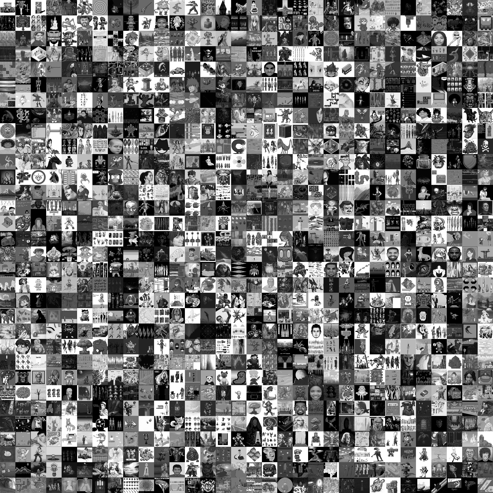

# ImageDatasetPreview
> A standalone tool for image dataset preview. 

## Tool Description

Given a `source directory` containing images, the tool reads all the images in this directory scale them down to a size provided from the user and then concatenates those scaled images into a matrix shaped image with those small images as elements, and those matrix images are saved in PNG formats in the `output_directory` provided by the user. 

## Installation
All that's needed to start using ImageDatasetPreview is to install the dependencies using the command
```
pip install -r src/to/dir/requirements.txt
```

## CLI Parameters

* `source_directory` _[string]_ - _[required]_ - The source directory of the dataset containing the images.
* `output_directory` _[string]_ - _[required]_ - The output directory to write the resulted images.

* `image_size` _[tuple(int,int)]_ - _[optional]_ The size to scale down the images to before being added to the preview matrix image, default is `(64,64)`

* `matrix_size` _[tuple(int,int)]_ - _[optional]_ -  The size of the preview matrix image (number of images to be included as width and height of the matrix), default is `(32,32)`

* `color_mode` _[str]_ - _[optional]_ -  the color mode of images to be `grey` or `rgb`, default is `rgb` 
* `images_order_mode` _[str]_ - _[optional]_ - The order of images of preview to be random (shuffled) or sorted based on the image file name, options are `random` or `sorted` default is `sorted`

* `base36` _[int]_ - _[optional]_ - Number of 1st N chars of base36 of the base64url of the sha256 of the image, if is set to `None` then nothing is applied, Please be careful when using this as it may result in duplication, so choose a large value to avoid collision, (choose values larger than 25)

* `num_workers` _[int]_ - _[optional]_ - Number of threads to be used in executing the process, default is `8` 

## Example Usage

```
python src/to/dir/ImageDatasetPreview.py --source_directory='./my-dataset' output_directory='./preview-images'
```

> Note that if the `output directory` is not created the tool automatically creates it for you. 

The tool will immediately starts working, and output the status of each image it process into the std output. 

Example Output 
```
finished batch 5 out of 35 batches
finished batch 6 out of 35 batches
finished batch 7 out of 35 batches
finished batch 8 out of 35 batches
finished batch 9 out of 35 batches
finished batch 10 out of 35 batches
finished batch 11 out of 35 batches
```

Each batch is representing a set of images to be previewed in one matrix image and saved in the `output_directory`

Example output of an `RGB` preview:


Example output of an `Grey` preview:


